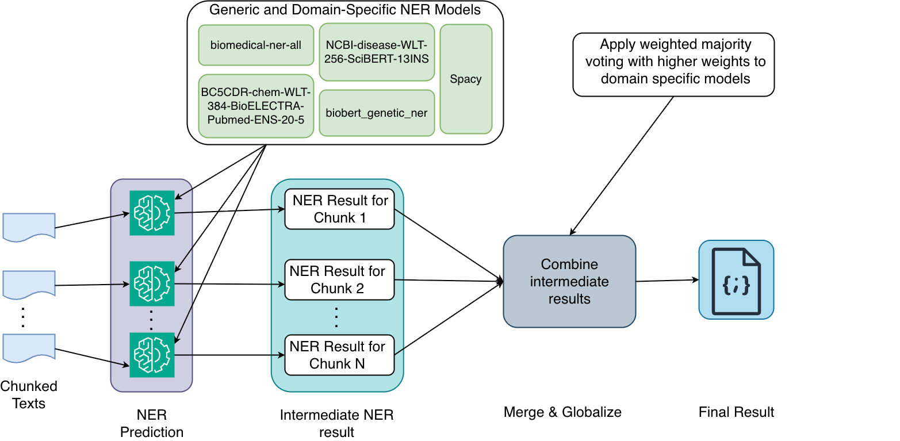

# What's Changed?
This document highlights the major changes made to the `StructSense`.
## New Changes

---
### 1. Implemented a new specialized `NER tool` for Named Entity Recognition to improve accuracy.
The current version implements the following specialized tool (see figure) for NER task using both LLM based approach and domain specific models.

### 2. Implements the specialized concept mapping tool, `Concept Mapping tool`, avoiding the need for manually maintaining the ontology database.
- The concept mapping tool implements features such as throttling (see default values below), i.e., minimum seconds between BioPortal requests (throttle; lower = faster, higher 429 risk). This done to take into account the rate limit of the bioportal.

    | Variable | Where used | Default | Description |
    |----------|------------|---------|-------------|
    | `BIOPORTAL_API_KEY` | `conceptmappingtool.py` | — | **Required** for ConceptMappingTool. Used in Authorization header. |
    | `BIOPORTAL_REQUEST_INTERVAL` | `conceptmappingtool.py` | `0.7` | Min seconds between BioPortal requests (throttle; lower = faster, higher 429 risk). |
    | `BIOPORTAL_BACKOFF_AFTER_429` | `conceptmappingtool.py` | `2.0` | Backoff seconds after 429. |
    | `MAX_CONCEPT_MAPPING_RESULTS` | `conceptmappingtool.py` | `1` | Top-N results per concept (1–50). |
    | `CONCEPT_MAPPING_CACHE_SIZE` | `conceptmappingtool.py` | `2000` | Max in-memory cache entries for concept mapping. |
    | `CONCEPT_MAPPING_MAX_TERMS` | `postprocessing.py` | — | Optional cap on how many unique terms are mapped in batch (rest get null). |

- To avoid the continuous API call, it implements the inmemory caching (to be replaced with new caching mechanism), i.e., `_CONCEPT_MAPPING_CACHE` (dict). The cache size is default `2000` set with `CONCEPT_MAPPING_CACHE_SIZE`. The FIFO-style cache eviction is applied, i.e., when the cache is full, one oldest entry is removed before inserting a new one. The lookup is done using `_map_single_concept()` before making an API call.
### 3. Implements automatic task detection
This version of **`StructSense`** introduces automatic task detection to support accurate task-to-tool mapping, enabling agents to invoke the most relevant tools for a given task.

The implementation combines an **LLM-based classifier** with a **heuristic fallback (e.g., see table below)** that relies on keyword matching from the task description, ensuring robustness when the LLM signal is weak or unavailable.
| Condition (keywords in description) | Returned task type |
|-------------------------------------|--------------------|
| `"ner"` or `"named entity"` or `"entity"` | `ner` |
| `"resource"` and (`"extract"` or `"dataset"` or `"tool"` or `"model"`) | `resource` |
| `"structured extraction"` or `"structured_extraction"` | `structured_extraction` |
| Otherwise | `extraction` |

Task detection is executed **once per stage** at the point where tools and post-processing are selected (e.g., `information_extraction_task`).
In the full pipeline, the **first stage’s task type** determines the post-processing key and the default result shape. While each stage may theoretically define its own task type, the initial stage serves as the canonical reference for downstream processing.

### 4. Fixed chunking behavior
The current implementation resolves previous issues with **chunking**. In earlier versions, chunking did not function correctly, which caused extraction and downstream processing to behave unexpectedly when handling chunked inputs.

### 5. Task-dependent post-processing

This version introduces task-specific post-processing logic, such as merging results across multiple chunks  and globalizing chunk-level outputs into a unified result.
These enhancements, e.g., `ner_post_process` `merge_ner_results` for NER are implemented in `postprocessing.py`.

### 6. Agent context manager
This version of **StructSense** also introduces a **context manager** to support tasks such as **token compression**, enabling more controlled and efficient handling of contextual information during processing.

- **File:** `src/utils/context_window_manager.py`
Handles token budgeting and compression for downstream agents.
- **Key Components:**
  - `ContextWindowManager`
  - `prepare_for_downstream_agent`
  - `estimate_tokens

- **File:** `src/utils/downstream_agent_helper.py`
Prepares inputs for alignment, judge, and human feedback agents, and merges results produced across multiple chunks.

- **Key Components:**
  - `prepare_alignment_agent_input`
  - `prepare_judge_agent_input`
  - `prepare_humanfeedback_agent_input`
  - `merge_structured_chunk_results`

- **File:** `src/utils/agent_context.py`
Maintains per-agent results, state, and confidence information in a thread-safe manner.
- **Key Components:**
  - `AgentContext`
  - `ThreadSafeMemory`

### Partial Runs

This version of **StructSense** supports **partial execution**, allowing you to run individual agents independently instead of executing the full pipeline.

For detailed examples and usage instructions, see the **[tutorial](tutorial/)** directory.

---
## Legacy
### . No longer using Weaviate vector database
We are no longer using the Weaviate vector database; therefore, the following keys are not required at this time. The utility code and corresponding environment variables remain in the codebase due to planned future use.
#### [Weaviate](https://weaviate.io/) Configuration
This configuration is optional and only necessary if you plan to integrate a knowledge source (e.g., a vector store) into the pipeline.

| Variable                   | Description                                  | Default   |
|---------------------------|----------------------------------------------|-----------|
| `WEAVIATE_HTTP_HOST`      | HTTP host for Weaviate                       | `localhost` |
| `WEAVIATE_HTTP_PORT`      | HTTP port for Weaviate                       | `8080`    |
| `WEAVIATE_HTTP_SECURE`    | Use HTTPS for HTTP connection (`true/false`) | `false`   |
| `WEAVIATE_GRPC_HOST`      | gRPC host for Weaviate                       | `localhost` |
| `WEAVIATE_GRPC_PORT`      | gRPC port for Weaviate                       | `50051`   |
| `WEAVIATE_GRPC_SECURE`    | Use secure gRPC (`true/false`)              | `false`   |

#### 🧪 Weaviate Timeouts

| Variable                   | Description                                  | Default   |
|---------------------------|----------------------------------------------|-----------|
| `WEAVIATE_TIMEOUT_INIT`   | Timeout for initialization (in seconds)     | `30`      |
| `WEAVIATE_TIMEOUT_QUERY`  | Timeout for query operations (in seconds)   | `60`      |
| `WEAVIATE_TIMEOUT_INSERT` | Timeout for data insertions (in seconds)    | `120`     |

#### 🤖 Ollama Configuration for WEAVIATE

| Variable              | Description                                   | Default                                 |
|-----------------------|-----------------------------------------------|-----------------------------------------|
| `OLLAMA_API_ENDPOINT` | API endpoint for Ollama model                 | `http://host.docker.internal:11434`     |
| `OLLAMA_MODEL`        | Name of the Ollama embedding model            | `nomic-embed-text`                      |

> **Note**:  If ollama is running in host machine and vector database, i.e., WEAVIATE, in docker, then we use `http://host.docker.internal:11434`, which is also the default value. However, if both are running in docker in the same host, use `http://localhost:11434 `.
#### 🧵 Optional: Experiment Tracking

| Variable               | Description                                                                | Default           |
|------------------------|----------------------------------------------------------------------------|-------------------|
| `ENABLE_WEIGHTSANDBIAS` | Enable [Weights & Biases](https://wandb.ai/site) monitoring (`true/false`) | `false`           |
| `ENABLE_MLFLOW`        | Enable [MLflow](https://mlflow.org/) logging (`true/false`)                | `false`           |
| `MLFLOW_TRACKING_URL`  | MLflow tracking server URL                                                 | `http://localhost:5000` |
> **Note**: `WEAVIATE_API_KEY` is only required when `ENABLE_KG_SOURCE=true`. For Weights & Biases you need to create a project and provide its key.
---
