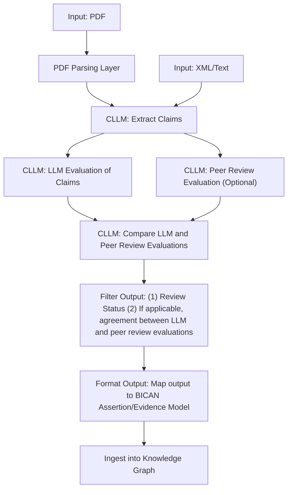

# CLLM Overview and Integration Proposal
## Overview of [CLLM (Claim LLM)](https://github.com/OpenEvalProject/cllm)
A command-line tool for extracting, evaluating, and comparing scientific claims using Large Language Models.

CLLM implements a 4-stage workflow for scientific claim verification:

1. **Extract Claims**: Extract atomic factual claims from a manuscript
2. **LLM Evaluation**: Group claims into results and evaluate them
3. **Peer Review Evaluation**: Group claims based on peer review commentary
4. **Compare Results**: Compare LLM and peer review evaluations

## MVP
Ingest assertions and evidence from scientific papers into the knowledge graph using CLLM, with the following steps:
1. **Input**: Accept PDF and XML/Text inputs of scientific papers.
2. **CLLM Processing**: Run the CLLM workflow to extract claims and evaluate them using LLM review.
3. **Output Processing**: Filter the CLLM outputs and format them to map to the BICAN Assertion/Evidence model.
4. **Knowledge Graph Ingestion**: Ingest the processed outputs into the knowledge graph for downstream applications.
### Todo:
1. Add PDF Parsing Layer to extract text from PDFs and feed it into the CLLM workflow.
2. Implement output processing to filter and format CLLM outputs for knowledge graph ingestion.

## Future Enhancements
- **Peer Review Integration**: Incorporate the peer review evaluation by working with domain-experts to annotate claims and evidence. This will allow us to compare LLM evaluations with human expert assessments.
- **UI Development**: Develop a user-friendly interface for interacting with the CLLM tool. This could include features for uploading papers, viewing extracted claims, evaluating claims, and visualizing the comparison between LLM and peer review evaluations.
- **Incorporate into StructSense Agentic Framework**: CLLM provides a concrete, well-scoped pipeline for assertion extraction and evaluation that allows us to move quickly and populate the knowledge graph. As this stabilizes, we can selectively extract the components and prompting strategies that prove effective and reimplement them as configurable agents within StructSense. This approach allows us to benefit from CLLM’s task-specific design today while preserving StructSense as the long-term, general-purpose agent workflow system.

## CLLM CLI Integration Architecture

## CLLM Output

| Paper | Extraction Metrics | Evaluation Metrics | Output Files | Notes |
|-------|---------|---------|---------|-------|
| [bioRxiv 2024.04.22.590194v2](https://www.biorxiv.org/content/10.1101/2024.04.22.590194v2) | **Number of Extracted Claims:** 142 **Model:** claude-sonnet-4-5-20250929 **Total Cost:** $0.523 **Processing Time:** 305.99 seconds | **Number of Result Groups:** 25 **Model:** claude-sonnet-4-5-20250929 **Total Cost:** $0.408 **Processing Time:** 96.29 seconds | [Output Files](https://drive.google.com/drive/u/0/folders/1HR-HIhbM4cw1nT-4iByaHtOqDdDcN18K) | |
| [bioRxiv 2025.12.02.691876](https://www.biorxiv.org/content/10.64898/2025.12.02.691876v1) | **Number of Extracted Claims:** 79 **Model:** claude-sonnet-4-5-20250929 **Total Cost:** $0.485 **Processing Time:** 173.44 seconds | **Number of Result Groups:** 21 **Model:** claude-sonnet-4-5-20250929 **Total Cost:** $0.454 **Processing Time:** 94.98 seconds | [Output Files](https://drive.google.com/drive/u/0/folders/1kdqbDrq_6Y4Es8Yf6gXco2fA8QDELVNp) | |
