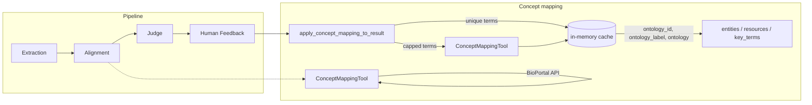
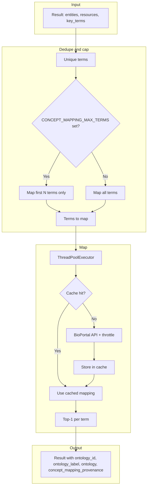

## Replace the Local Ontology Database with BioPortal

## Overview

The current system relies on a locally managed ontology database for concept mapping. While this approach provides fine-grained control over ontology versions and indexing, it introduces significant operational overhead. Ontologies must be manually ingested, updated, versioned, and maintained, which becomes a recurring maintenance burden.

This design proposes replacing the local ontology database with **[BioPortal](https://bioportal.bioontology.org/)**, a managed ontology repository provided by the National Center for Biomedical Ontology (NCBO). BioPortal offers programmatic access to a wide range of high-quality, actively maintained biomedical ontologies via APIs, significantly reducing operational complexity while improving coverage and freshness of ontology content.

## Problem Statement

### Current State: Local Ontology Database

* Ontologies are manually downloaded, ingested, and indexed
* Database infrastructure must be provisioned, monitored, and scaled
* Ontology updates require periodic re-ingestion
* Coverage is limited to explicitly managed ontologies

### Key Challenges

* High operational and maintenance cost
* Risk of outdated ontology versions
* Limited access to emerging or specialized ontologies
* Engineering effort diverted to data maintenance rather than feature development

## Proposed Solution

### Use BioPortal as the Ontology Backend

BioPortal provides a managed, cloud-based ontology service with:

* 1,000+ biomedical ontologies (e.g., SNOMED CT, MONDO, NCIT, GO, HP, CHEBI)
* Regular updates maintained by ontology owners
* REST APIs for search, recommendation, and concept lookup
* Built-in ontology recommendation based on input text

The system will replace direct database lookups with BioPortal API calls for concept-to-ontology mapping.

## Functional Requirements

1. Accept ontology concept input from clients

   * Single concept (e.g., `diabetes`)
   * Multiple concepts (e.g., `diabetes,cancer,asthma`)
   * Phrases or sentences (e.g., `diabetic kidney disease`)

2. Automatically detect relevant ontologies when not explicitly provided

3. Return, for each concept:

   * Ontology IRI
   * Preferred label  
   * Ontology (acronym)
   * Example response
    ```json
    {
        "ontology_id": "http://www.radlex.org/RID/RID6529",
        "ontology_label": "hippocampus", 
        "ontology": "RADLEX"
    }
    ```
*Note:* By default the response should be top 1. But in case of top N, e.g., user chose top 2, in that case `ontology_id` should be list containing all IRI.
* Example response for top 2
 ```json
 {
     "ontology_id": ["http://www.radlex.org/RID/RID6529", "http://purl.org/sig/ont/fma/fma275020"],
     "ontology_label": "hippocampus",
    "ontology": ["RADLEX","FMA"]
 }
```
4. Support both single and batch requests through the same interface

## Non-Functional Requirements

* No local ontology storage or ingestion pipeline
* Secure API key management
* Graceful handling of API failures
* Reasonable response time
* Extensible design for future ontology providers


## Advantages of BioPortal-Based Approach

### Operational Benefits

* No ontology ingestion or database maintenance
* Automatic access to up-to-date ontologies
* Reduced infrastructure and DevOps burden

### Functional Benefits

* Broader ontology coverage
* Improved concept mapping accuracy via recommender
* Faster onboarding of new ontology domains

### Strategic Benefits

* Focus engineering effort on product features
* Align with widely adopted biomedical standards
* Future-proof ontology access strategy

## Trade-offs and Limitations

* Reduced control over ontology versions compared to local storage
* Dependency on external service availability
* API rate limits may require monitoring or caching in the future

## Current Implementation

Concept mapping is implemented via **ConceptMappingTool** (BioPortal API) and applied in two places:

1. **Alignment agent** — Can call the tool during alignment to extend entities/resources/key_terms with `ontology_id`, `ontology_label`, `ontology`, and `concept_mapping_provenance` (`"tool"` or `"llm_knowledge"`).
2. **Postprocessing** — After the pipeline, `apply_concept_mapping_to_result()` runs over all entities, resources (name/target/specific_target), and key_terms, filling in ontology fields with provenance `"tool"`.

Alignment output is **top-1 per term**: a single `ontology_id` / `ontology_label` / `ontology` per item. If the API returns multiple matches, only the first is stored.

### Pipeline and concept mapping flow





### Environment variables

| Variable | Purpose | Default |
|----------|---------|--------|
| `BIOPORTAL_API_KEY` | BioPortal API key (required for tool) | — |
| `MAX_CONCEPT_MAPPING_RESULTS` | Max mappings per term (1 = top-1 only) | `1` |
| `CONCEPT_MAPPING_MAX_TERMS` | Cap on unique terms to map (rest get `null`); speeds up large results | No cap |
| `CONCEPT_MAPPING_CACHE_SIZE` | Max in-memory cache entries (term → mapping) | `2000` |
| `BIOPORTAL_REQUEST_INTERVAL` | Min seconds between API requests (lower = faster, risk 429) | `0.7` |
| `BIOPORTAL_BACKOFF_AFTER_429` | Extra wait (seconds) after 429 before retry | `2.0` |

### Speed optimizations for large results

* **Deduplication** — One API call per unique term (shared across entities, resources, key_terms).
* **In-memory cache** — Same term in later runs or documents reuses cached mapping (no extra API call).
* **Term cap** — Set `CONCEPT_MAPPING_MAX_TERMS=500` (or similar) to map only the first N unique terms; remaining terms get `null` mapping.
* **Throttle** — `BIOPORTAL_REQUEST_INTERVAL` is read at request time; try `0.4` if your key allows (watch for 429).

### Output shape (top-1)

Per entity/resource/key_term, alignment and postprocessing set:

* `ontology_id` — Single IRI string (or `null`).
* `ontology_label` — Single label string (or `null`).
* `ontology` — Single ontology acronym (or `null`).
* `concept_mapping_provenance` — `"tool"` (BioPortal) or `"llm_knowledge"` (alignment agent only).

If the tool returns multiple matches, only the first is stored (top-1). For top-N behavior, set `MAX_CONCEPT_MAPPING_RESULTS` > 1; postprocessing still normalizes to top-1 for the stored result.

---

## Future Enhancements

* ~~Optional response caching for frequently queried concepts~~ — Implemented (in-memory cache + `CONCEPT_MAPPING_CACHE_SIZE`).
* Configurable ontology allowlists per domain
* Hybrid mode (local cache + BioPortal fallback)

## Conclusion

Replacing the local ontology database with BioPortal significantly simplifies system architecture while improving ontology coverage and freshness. The proposed design removes the operational burden of ontology management and leverages a mature, community-supported platform, making it a scalable and sustainable solution for ontology concept mapping. The current implementation adds caching, optional term capping, and configurable throttling to keep concept mapping fast on large result sets.
