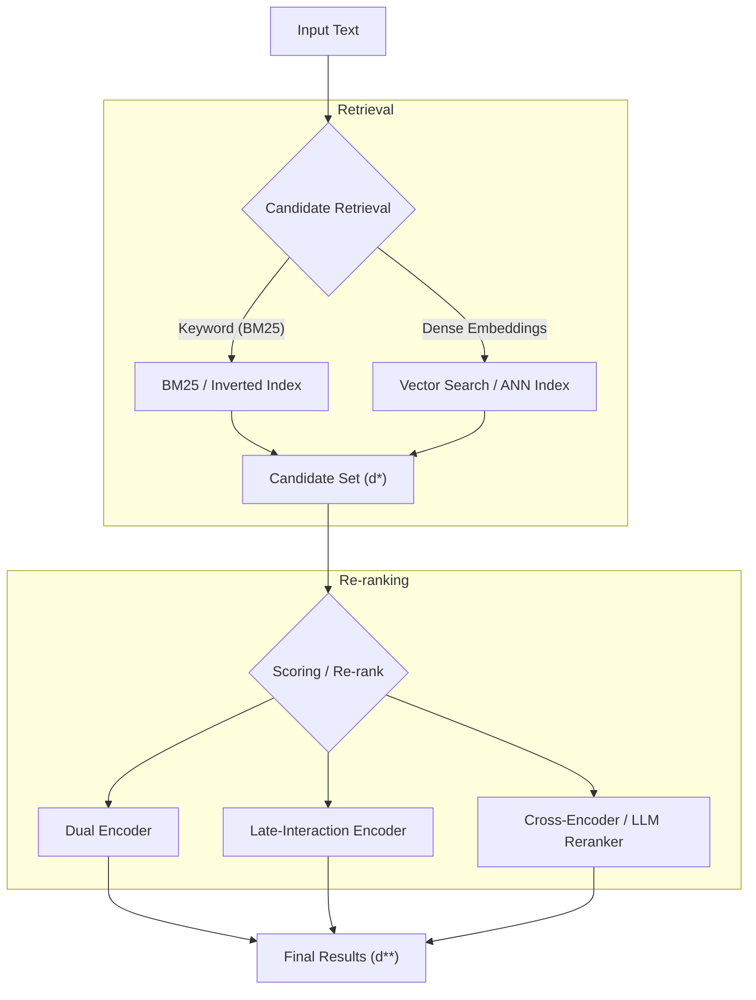

# Search Design Document

## Task
Given a query $q$, the system aims to retrieve the most relevant concept or document $d$ from a candidate set $\mathcal{D}$. In our context, this task necessitates identifying the relevant ontological concepts to a given entity (e.g., in Named Entity Recognition scenarios) or to a broader text input, enabling semantic grounding and structured representation of the extracted information.

## Current Situation

Currently, we use **BioPortal** as our ontology database. BioPortal is a well-established, community-trusted platform that hosts and manages a large number of ontologies. However, these benefits come with several trade-offs:

1. **Dependency on BioPortal** — If BioPortal is unavailable (for example, during upgrades), our use case is directly impacted.  
2. **API rate limits** — Rate limiting can slow down API calls. While this is understandable given BioPortal’s design and shared usage model, it affects performance.  
3. **Implementation dependency** — We rely on BioPortal’s implementations (e.g., search), which may not always be optimal or fully aligned with our specific use case.

## Overview & Requirements

Before further detail, let’s first understand the steps involved. This task typically consists of two main stages:**retrieval** and **reranking**.

In the first stage, **retrieval**, the objective is to identify a subset of potentially relevant candidates from $\mathcal{D}$. This is achieved by maximizing a scoring function $f(q, d)$, which estimates the relevance between the query and each candidate document:

$$
d^* = \arg\max_{d \in \mathcal{D}} f(q, d)
$$

Note at this stage we want to prioritize high recall and computational efficiency. 

In the second stage, **reranking**, the retrieved candidates $\mathcal{D}_K$ are re-evaluated using a more expressive (and often computationally expensive) relevance model $g(q, d)$. The goal is to refine the initial ordering by more precisely estimating relevance:

$$
d^{**} = \arg\max_{d \in \mathcal{D}_K} g(q, d)
$$

With this in mind, we define the following search requirements (focused on algorithms not system design):

1. **Contextualized retrieval** — The implementation must overcome the limitations of sparse retrieval methods such as BM25 and basic similarity scoring, which lack contextual understanding. This includes support for contextualized approaches such as cross-encoders, dual-encoders and late interaction models (e.g., ColBERT).
2. **Keyword-based retrieval** — The system must also support fast and efficient keyword-based search.
3. **Generalizability** — The implementation should be easily adaptable to other use cases with minimal or no additional effort.

## Proposed approach
The figure below presents a high-level overview of the proposed approach. Note that not all techniques shown will be used simultaneously; the final selection depends on trade-offs such as accuracy versus computational cost. For example, cross-encoding techniques offer high accuracy but are computationally expensive. Dual-encoder (or bi-encoder) techniques, on the other hand, provide a better balance between accuracy and computational efficiency.

## Implementation

The system will be implemented as an API-first service. Agents and external clients will consume the same API endpoints, ensuring a unified interface, consistent behavior, and eliminating duplicate implementations across tool and service layers.

The API will encapsulate the full retrieval and ranking pipeline, including candidate retrieval, and reranking. The architecture will remain modular to allow interchangeable ranking components while preserving a stable external interface.

### Ranking and Retrieval Strategy

The implementation will prioritize a hybrid retrieval and reranking approach, combining fast lexical retrieval with dense and late-interaction models for improved accuracy. The following models and methods will be evaluated and integrated where appropriate:

- Li, Y., Li, J., Yu, M., Ding, G., Lin, Z., Wang, W. and Zhou, J., 2026. Query-focused and Memory-aware Reranker for Long Context Processing. arXiv preprint arXiv:2602.12192.

- Lù, X.H., 2024. Bm25s: Orders of magnitude faster lexical search via eager sparse scoring. arXiv preprint arXiv:2407.03618.

- Jha, R., Wang, B., Günther, M., Mastrapas, G., Sturua, S., Mohr, I., Koukounas, A., Wang, M.K., Wang, N. and Xiao, H., 2024, November. Jina-colbert-v2: A general-purpose multilingual late interaction retriever. In Proceedings of the Fourth Workshop on Multilingual Representation Learning (MRL 2024) (pp. 159-166).

- Zhang, Y., Li, M., Long, D., Zhang, X., Lin, H., Yang, B., Xie, P., Yang, A., Liu, D., Lin, J. and Huang, F., 2025. Qwen3 embedding: Advancing text embedding and reranking through foundation models. arXiv preprint arXiv:2506.05176.

- BiomedBERT Reranker - [https://huggingface.co/NeuML/biomedbert-base-reranker](https://huggingface.co/NeuML/biomedbert-base-reranker)

### Design Principles

- API-first architecture with a single service interface
- Modular retrieval and ranking components
- Support for sparse, dense, and late-interaction methods
- Configurable reranking layer (neural or LLM-based)
- Scalability for large candidate concept sets
- Extensibility for domain-specific models
- **Provenance by design**, ensuring that model versions, configurations, scoring methods, and retrieval metadata are tracked and reproducible

This design enables flexible experimentation with retrieval and reranking strategies while maintaining a stable and production-ready service interface.
